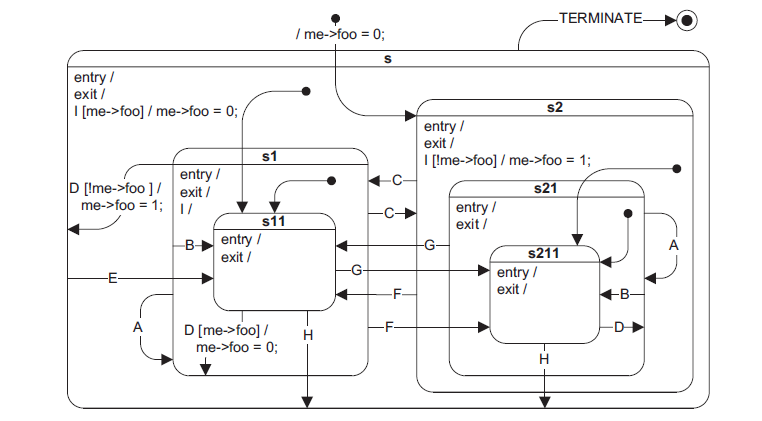

#About this example
This state machine diagram has been taken directly for Miro Samek book "Practical UML statecharts in C/C++, second édition" (p88)
It features all possible transitions types a hierarchical state machine may have.

***Note**: "Hello world ! " printing is a personal adding*



Files :
- **test.cpp**: Example main, instanciates and setup the HSM, then injects the events into it
- **original_qhsmtst.cpp / original_qhsmtst.hpp**: Defines user custom states and HSM, which are derived from the ones of the framework.

#How to run it ?
At the root of the project, create an empty directory for your architecture build files:
`mkdir my-build-dir`

and cd to it:  
``` cd my-build-dir ```

Generate makefiles:  
``` cmake -G "CodeBlocks - Unix Makefiles" ../ ```

Build project:  
``` make ```

Run:  
``` ./Examples/qhsmtst/qhsmtst ```
